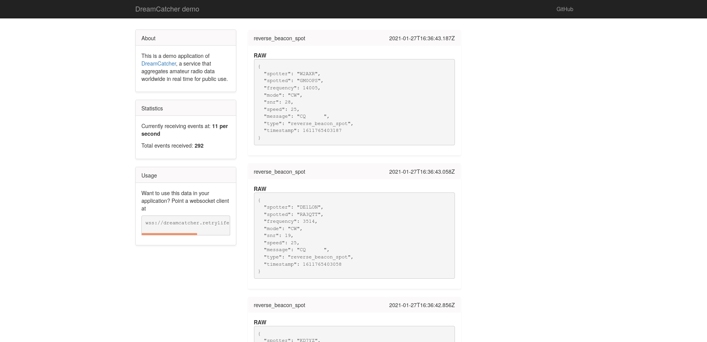

# DreamCatcher [](https://dreamcatcher.retrylife.ca/) [](https://hub.docker.com/r/ewpratten/dreamcatcher_app)

A service that aggregates amateur radio data worldwide in real time for public use. The goal of DreamCatcher is to expose an event stream of everything going on in the amateur radio bands to client applications via websockets.

## How it works

DreamCatcher works by hooking into TCP streams provided by services like APRS-IS and DXWatch. This application then parses, formats, and re-broadcasts the data to all websocket subscribers.

## Demo

A demo webapp is avalible to showcase the raw data stream. This can be found [here](https://dreamcatcher.retrylife.ca/).



## Self-hosting

This service is available as a self-contained Docker container which can be run as:

```sh
docker pull ewpratten/dreamcatcher_app:latest
docker run -it ewpratten/dreamcatcher_app:latest
```

The webserver runs inside the container on port `8887`
